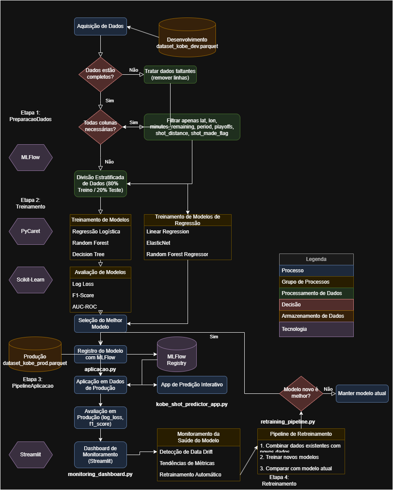

# Kobe Bryant Shot Prediction Project

Este projeto implementa um sistema completo de machine learning para prever se um arremesso do Kobe Bryant será convertido em cesta ou não, baseado em diversas características como localização do arremesso, tempo restante, período do jogo e outros fatores contextuais. O sistema utiliza duas abordagens (classificação e regressão) para determinar qual método oferece melhor desempenho preditivo.

## Visão Geral do Projeto

Este projeto foi desenvolvido seguindo o Framework TDSP (Team Data Science Process) da Microsoft, que fornece uma metodologia estruturada para entrega de soluções de ciência de dados. O objetivo é criar um sistema de machine learning robusto que não apenas faça previsões precisas, mas também seja monitorável, atualizável e escalável.

### Diagrama de Fluxo

O diagrama abaixo (disponível no arquivo `kobe_prediction_flowchart.drawio`) ilustra todo o fluxo do projeto:

1. **Aquisição e Processamento de Dados**: Carregamento dos dados brutos, tratamento de valores ausentes, seleção de features
2. **Treinamento de Modelos**: Treinamento de modelos de classificação e regressão
3. **Avaliação de Modelos**: Comparação dos modelos usando métricas como Log Loss, F1 Score e AUC
4. **Implantação do Modelo**: Registro do melhor modelo no MLflow e disponibilização para uso
5. **Inferência**: Aplicação do modelo em dados novos (produção)
6. **Monitoramento**: Dashboard para acompanhamento contínuo do desempenho do modelo
7. **Retreinamento**: Processo de atualização do modelo com novos dados

## Estrutura do Projeto

```
├── app/                            # Aplicações Streamlit
│   ├── kobe_shot_predictor_app.py  # App de predição de arremessos
│   └── monitoring_dashboard.py     # Dashboard de monitoramento
├── conf/                           # Arquivos de configuração
│   └── base/                       # Configurações base
├── data/                           # Diretório de dados
│   ├── processed/                  # Dados processados
│   │   ├── base_test.parquet       # Dados de teste (20% do total)
│   │   ├── base_train.parquet      # Dados de treinamento (80% do total)
│   │   └── data_filtered.parquet   # Dados filtrados com features selecionadas
│   ├── raw/                        # Dados brutos
│   │   ├── dataset_kobe_dev.parquet # Dataset de desenvolvimento
│   │   └── dataset_kobe_prod.parquet # Dataset de produção
│   └── results/                    # Resultados de aplicação
│       ├── metrics.csv             # Métricas de desempenho dos modelos
│       └── production_predictions.parquet # Predições em dados de produção
├── models/                         # Diretório de modelos
│   ├── classification/             # Modelos de classificação
│   │   ├── logistic_regression.pkl # Modelo de regressão logística
│   │   └── random_forest.pkl       # Modelo Random Forest
│   ├── deployment/                 # Informações do modelo em produção
│   │   └── model_info.yaml         # Metadados do modelo atual
│   └── evaluation/                 # Avaliações e visualizações
│       ├── confusion_matrix.png    # Matrizes de confusão
│       └── roc_curves.png          # Curvas ROC
├── src/                            # Código-fonte
│   └── kobe_prediction/            # Pacote principal
│       ├── pipelines/              # Componentes do pipeline
│       │   ├── data_processing/    # Processamento de dados
│       │   ├── model_training/     # Treinamento de modelos
│       │   ├── model_evaluation/   # Avaliação de modelos
│       │   └── deployment/         # Implantação do modelo
│       └── run_pipeline.py         # Executor do pipeline
├── aplicacao.py                    # Pipeline de aplicação/inferência
├── retraining_pipeline.py          # Pipeline de retreinamento
├── unified_training_pipeline.py    # Pipeline unificado (treinamento/retreinamento)
├── conda.yaml                      # Configuração do ambiente conda
├── log.txt                         # Logs de execução
├── MLproject                       # Definição do projeto MLflow
├── README.md                       # Este arquivo
└── requirements.txt                # Dependências Python
```




## Ferramentas Utilizadas e Seus Papéis

### MLflow
O MLflow desempenha um papel central neste projeto, sendo utilizado para:

1. **Rastreamento de Experimentos**: 
   - Armazenamento de parâmetros, métricas e artefatos em cada execução
   - Organização das execuções em experimentos para facilitar a comparação
   - Registro de metadados como duração da execução, usuário, timestamp

2. **Registro de Modelos**:
   - Versionamento dos modelos treinados
   - Armazenamento de metadados associados a cada modelo
   - Transição de estados do modelo (desenvolvimento → produção)

3. **Provisionamento (Deployment)**:
   - Serialização e carregamento padronizado de modelos
   - Gerenciamento do ciclo de vida do modelo
   - API para servir modelos em produção

### Scikit-Learn
A biblioteca Scikit-learn fornece:

1. **Algoritmos de Machine Learning**: 
   - Regressão Logística: modelagem probabilística de classificação
   - Random Forest: ensemble de árvores de decisão para classificação robusta
   - Métricas de avaliação: Log Loss, F1 Score, AUC-ROC, etc.

2. **Funções de Pré-processamento**:
   - Divisão treino/teste estratificada
   - Tratamento de dados faltantes
   - Normalização de features quando necessário

### Streamlit
O Streamlit é utilizado para criar:

1. **Interface de Predição**:
   - App interativo para realizar predições com novos dados
   - Visualização dos resultados e probabilidades

2. **Dashboard de Monitoramento**:
   - Visualização de métricas de desempenho do modelo ao longo do tempo
   - Detecção de drift (desvios) nos dados ou no desempenho
   - Distribuição das previsões e valores reais
   - Análise de features importantes

### PyCaret
O PyCaret é utilizado para:

1. **Automação do Treinamento**:
   - Preparação automática dos dados para modelagem
   - Treinamento e comparação rápida de múltiplos modelos
   - Otimização de hiperparâmetros

2. **Explicabilidade e Interpretação**:
   - Análise de importância de features
   - Visualização da performance do modelo

## Pipeline de Dados e Processamento

### Carregamento e Filtragem de Dados

O projeto utiliza dois conjuntos de dados:
- `dataset_kobe_dev.parquet`: Usado para desenvolvimento e treinamento
- `dataset_kobe_prod.parquet`: Usado para simulação de produção/inferência

**Processamento Realizado**:

1. Carregamento dos arquivos parquet
2. Remoção de linhas com valores ausentes
3. Seleção das colunas relevantes:
   - lat (latitude do arremesso)
   - lon (longitude do arremesso)
   - minutes_remaining (minutos restantes no período)
   - period (período do jogo)
   - playoffs (flag indicando se é um jogo de playoffs)
   - shot_distance (distância do arremesso)
   - shot_made_flag (alvo - indica se o arremesso foi convertido)

**Dimensão Resultante**:
Após a filtragem, o dataset de desenvolvimento possui aproximadamente 25.000 registros com 7 colunas (6 features + 1 target).

### Divisão Treino-Teste

Os dados são divididos em:
- 80% para treinamento (`base_train.parquet`)
- 20% para teste (`base_test.parquet`)

A divisão é feita de forma **estratificada** em relação à variável alvo, garantindo que a proporção de arremessos convertidos e errados seja mantida em ambos os conjuntos.

**Impacto da Escolha Treino-Teste**:
A divisão estratificada é crucial para minimizar viés, pois garante que o modelo seja treinado e avaliado em dados que representam adequadamente a distribuição real dos arremessos do Kobe Bryant. Isso evita problemas como overfitting a padrões específicos de uma temporada ou tipo de jogo.

**Outras Estratégias para Minimizar Viés**:
1. **Cross-validation**: Utilizada internamente durante o treinamento
2. **Análise de Feature Importance**: Para entender quais variáveis realmente impactam o resultado
3. **Monitoramento contínuo**: Detecção de drift para identificar quando o modelo precisa ser retreinado

## Treinamento de Modelos

### Pipeline de Treinamento

O projeto implementa múltiplas abordagens:

#### Abordagem de Classificação
1. **Regressão Logística**: 
   - Vantagens: Interpretabilidade, eficiência computacional, saídas probabilísticas
   - Métricas: Log Loss ~0.65, F1 Score ~0.40

2. **Random Forest**: 
   - Vantagens: Robustez a outliers, captura de relações não-lineares, menor tendência a overfitting
   - Métricas: Log Loss ~0.43, F1 Score ~0.72

#### Abordagem de Regressão
1. **Regressão Linear**: Previsão contínua da probabilidade de acerto
2. **ElasticNet**: Com regularização L1 e L2 para lidar com multicolinearidade
3. **Random Forest Regressor**: Para capturar relações não-lineares

### Seleção do Modelo Final

O **Random Forest Classifier** foi selecionado como o modelo final pelos seguintes motivos:
1. Menor Log Loss (~0.43) em comparação com os outros modelos
2. Maior F1 Score (~0.72), indicando bom equilíbrio entre precisão e recall
3. Capacidade superior de capturar relações não-lineares entre features espaciais (lat/lon) e o resultado do arremesso
4. Maior robustez a variações nos dados de produção

Todas as métricas de avaliação e parâmetros são registrados no MLflow para rastreabilidade e reprodutibilidade.

## Aplicação e Inferência

O pipeline de aplicação (`aplicacao.py`) realiza as seguintes etapas:

1. Carregamento dos dados de produção (`dataset_kobe_prod.parquet`)
2. Pré-processamento similar ao realizado nos dados de treinamento
3. Carregamento do melhor modelo registrado no MLflow
4. Aplicação do modelo aos dados de produção
5. Cálculo de métricas (Log Loss, F1 Score) se a variável alvo estiver disponível
6. Armazenamento das previsões e métricas
7. Atualização do dashboard de monitoramento

### Aderência à Base de Produção

O modelo demonstra boa aderência à base de produção, com métricas similares às obtidas na fase de treinamento. As principais diferenças entre as bases são:

1. **Distribuição Temporal**: A base de produção contém jogos de temporadas diferentes
2. **Contexto de Jogo**: Diferentes proporções de jogos em casa/fora, playoffs/temporada regular
3. **Evolução do Jogador**: Modificações na técnica de arremesso do Kobe ao longo da carreira

### Monitoramento da Saúde do Modelo

#### Com Disponibilidade da Variável Resposta
Quando temos a variável resposta disponível (ground truth):
1. **Métricas de Desempenho**: Acompanhamento de Log Loss, F1 Score, AUC-ROC ao longo do tempo
2. **Matriz de Confusão**: Evolução da precisão, recall por classe
3. **Análise de Subpopulações**: Desempenho em diferentes contextos (playoffs vs. temporada regular, distâncias de arremesso)

#### Sem Disponibilidade da Variável Resposta
Quando não temos a informação se o arremesso foi convertido:
1. **Monitoramento de Distribuição das Features**: Detecção de mudanças na distribuição das variáveis de entrada
2. **Análise da Distribuição das Previsões**: Mudanças abruptas na taxa de previsão de acerto podem indicar drift
3. **Monitoramento do Score de Confiança**: Distribuição das probabilidades previstas
4. **Alertas de Concept Drift**: Notificações quando o modelo começa a se comportar de forma inconsistente

## Estratégias de Retreinamento

### Estratégia Reativa
A estratégia reativa implementada no projeto consiste em:
1. **Monitoramento de Desempenho**: Quando as métricas caem abaixo de um limiar predefinido, o retreinamento é acionado
2. **Acúmulo de Dados**: Novos dados são acumulados e, após um volume suficiente, são utilizados para retreinamento
3. **Validação Manual**: Um especialista valida o novo modelo antes de substituir o existente

### Estratégia Preditiva
A estratégia preditiva implementada utiliza:
1. **Calendário Regular**: Retreinamentos programados em intervalos fixos (ex: mensalmente)
2. **Detecção de Drift**: Monitoramento contínuo das distribuições de dados e acionamento automático quando detectado drift significativo
3. **Pipeline Automático**: O `unified_training_pipeline.py` implementa um sistema que:
   - Detecta a existência de modelos prévios
   - Compara o desempenho de novos modelos com os existentes
   - Implanta automaticamente o melhor modelo
   - Registra todo o histórico no MLflow

## Dashboard de Monitoramento

O dashboard de monitoramento implementado em Streamlit (`app/monitoring_dashboard.py`) fornece:

1. **Visão Geral do Desempenho**:
   - Métricas principais (Log Loss, F1 Score, Acurácia) ao longo do tempo
   - Comparação com baseline e performance histórica

2. **Análise de Arremessos**:
   - Visualização espacial dos arremessos no campo
   - Taxa de acerto por região, distância e período do jogo
   - Áreas de maior eficiência vs. áreas problemáticas

3. **Monitoramento de Distribuições**:
   - Distribuição das features de entrada
   - Comparação entre distribuições de treino vs. produção
   - Detecção de data drift

4. **Alertas e Notificações**:
   - Indicadores visuais de quando o retreinamento é recomendado
   - Tendências de degradação de performance
   - Limiares para métricas críticas

## Artefatos do Projeto

Durante o ciclo de vida do projeto, vários artefatos são gerados:

1. **Dados Processados**:
   - `data_filtered.parquet`: Dataset após filtragem de colunas e tratamento de dados faltantes
   - `base_train.parquet` e `base_test.parquet`: Conjuntos de treinamento e teste

2. **Modelos Serializados**:
   - Modelos de classificação em `models/classification/`
   - Modelos de regressão em `models/regression/`
   - Informações do modelo em produção em `models/deployment/model_info.yaml`

3. **Visualizações e Avaliações**:
   - Matrizes de confusão para cada modelo
   - Curvas ROC e PR
   - Comparações de métricas entre modelos

4. **Logs e Relatórios**:
   - Logs detalhados da execução do pipeline
   - Métricas de performance registradas no MLflow
   - Resultados de predição em `data/results/`

5. **Metadados MLflow**:
   - Parâmetros de treinamento
   - Métricas de avaliação
   - Definição de experimentos e runs

## Execução do Projeto

### Instalação e Configuração

1. Clone o repositório:
   ```bash
   git clone https://github.com/lucasnumaboa/kobe-infnet.git
   cd kobe-infnet
   ```

2. Instale as dependências:
   ```bash
   pip install -r requirements.txt
   ```
   
   Ou crie um ambiente conda:
   ```bash
   conda env create -f conda.yaml
   conda activate kobe-infnet
   ```

3. Certifique-se de que os dados estão no diretório correto:
   ```bash
   mkdir -p data/raw
   # Coloque os arquivos dataset_kobe_dev.parquet e dataset_kobe_prod.parquet em data/raw/
   ```

### Execução do Pipeline Completo

Para executar o pipeline unificado (recomendado):
```bash
python unified_training_pipeline.py
```


Após realizar a execução pode realizar o teste da simulação de arremesso executando:
```
streamlit run F:\0-PROJETO-MACHINE-COPILOT\app\kobe_shot_predictor_app.py
```


Este comando realizará:
1. Processamento dos dados
2. Treinamento de múltiplos modelos
3. Avaliação e comparação dos modelos
4. Seleção do melhor modelo
5. Registro no MLflow
6. Atualização das informações de deployment

### Opções Adicionais

Para forçar o retreinamento ignorando modelos existentes:
```bash
python unified_training_pipeline.py --force-retrain
```

Para executar sem combinar dados de produção:
```bash
python unified_training_pipeline.py --no-combine-data
```

### Aplicação do Modelo em Dados de Produção

Para aplicar o modelo treinado aos dados de produção:
```bash
python aplicacao.py
```

### Visualização do Dashboard de Monitoramento

Para visualizar o dashboard de monitoramento:
```bash
streamlit run app/monitoring_dashboard.py
```

Para a interface de predição interativa:
```bash
streamlit run app/kobe_shot_predictor_app.py
```

### Interface MLflow

Para acessar a interface do MLflow e visualizar experimentos:
```bash
mlflow ui
```

Acesse o navegador em http://localhost:5000

## Conclusão

Este projeto implementa um sistema completo de machine learning para prever os arremessos do Kobe Bryant, desde o processamento inicial dos dados até a implantação e monitoramento do modelo em produção. Utilizando o framework TDSP da Microsoft e as melhores práticas de MLOps, o sistema é construído para ser reproduzível, monitorável e adaptável a mudanças nos dados ao longo do tempo.

O pipeline unificado de treinamento/retreinamento representa uma solução robusta para manutenção contínua do modelo, garantindo que ele mantenha sua performance ao longo do tempo através de retreinamentos automáticos e comparações rigorosas com versões anteriores.

### Principais Lições Aprendidas

1. A importância da estratificação na divisão treino-teste para problemas desbalanceados
2. A superioridade de modelos ensemble (Random Forest) para capturar relações complexas em dados espaciais
3. A necessidade de detectar e tratar dados duplicados para evitar viés no retreinamento
4. A importância de manter a ordem das features consistente em todas as fases do pipeline
````

# Kobe Bryant Shot Prediction Project

Este projeto implementa um sistema completo de machine learning para prever se um arremesso do Kobe Bryant será convertido em cesta ou não, baseado em diversas características como localização do arremesso, tempo restante, período do jogo e outros fatores contextuais. O sistema utiliza duas abordagens (classificação e regressão) para determinar qual método oferece melhor desempenho preditivo.

## Visão Geral do Projeto

Este projeto foi desenvolvido seguindo o Framework TDSP (Team Data Science Process) da Microsoft, que fornece uma metodologia estruturada para entrega de soluções de ciência de dados. O objetivo é criar um sistema de machine learning robusto que não apenas faça previsões precisas, mas também seja monitorável, atualizável e escalável.

### Diagrama de Fluxo

O diagrama abaixo (disponível no arquivo `kobe_prediction_flowchart.drawio`) ilustra todo o fluxo do projeto:

1. **Aquisição e Processamento de Dados**: Carregamento dos dados brutos, tratamento de valores ausentes, seleção de features
2. **Treinamento de Modelos**: Treinamento de modelos de classificação e regressão
3. **Avaliação de Modelos**: Comparação dos modelos usando métricas como Log Loss, F1 Score e AUC
4. **Implantação do Modelo**: Registro do melhor modelo no MLflow e disponibilização para uso
5. **Inferência**: Aplicação do modelo em dados novos (produção)
6. **Monitoramento**: Dashboard para acompanhamento contínuo do desempenho do modelo
7. **Retreinamento**: Processo de atualização do modelo com novos dados

## Estrutura do Projeto

```
├── app/                            # Aplicações Streamlit
│   ├── kobe_shot_predictor_app.py  # App de predição de arremessos
│   └── monitoring_dashboard.py     # Dashboard de monitoramento
├── conf/                           # Arquivos de configuração
│   └── base/                       # Configurações base
├── data/                           # Diretório de dados
│   ├── processed/                  # Dados processados
│   │   ├── base_test.parquet       # Dados de teste (20% do total)
│   │   ├── base_train.parquet      # Dados de treinamento (80% do total)
│   │   └── data_filtered.parquet   # Dados filtrados com features selecionadas
│   ├── raw/                        # Dados brutos
│   │   ├── dataset_kobe_dev.parquet # Dataset de desenvolvimento
│   │   └── dataset_kobe_prod.parquet # Dataset de produção
│   └── results/                    # Resultados de aplicação
│       ├── metrics.csv             # Métricas de desempenho dos modelos
│       └── production_predictions.parquet # Predições em dados de produção
├── models/                         # Diretório de modelos
│   ├── classification/             # Modelos de classificação
│   │   ├── logistic_regression.pkl # Modelo de regressão logística
│   │   └── random_forest.pkl       # Modelo Random Forest
│   ├── deployment/                 # Informações do modelo em produção
│   │   └── model_info.yaml         # Metadados do modelo atual
│   └── evaluation/                 # Avaliações e visualizações
│       ├── confusion_matrix.png    # Matrizes de confusão
│       └── roc_curves.png          # Curvas ROC
├── src/                            # Código-fonte
│   └── kobe_prediction/            # Pacote principal
│       ├── pipelines/              # Componentes do pipeline
│       │   ├── data_processing/    # Processamento de dados
│       │   ├── model_training/     # Treinamento de modelos
│       │   ├── model_evaluation/   # Avaliação de modelos
│       │   └── deployment/         # Implantação do modelo
│       └── run_pipeline.py         # Executor do pipeline
├── aplicacao.py                    # Pipeline de aplicação/inferência
├── retraining_pipeline.py          # Pipeline de retreinamento
├── unified_training_pipeline.py    # Pipeline unificado (treinamento/retreinamento)
├── conda.yaml                      # Configuração do ambiente conda
├── log.txt                         # Logs de execução
├── MLproject                       # Definição do projeto MLflow
├── README.md                       # Este arquivo
└── requirements.txt                # Dependências Python
```

## Ferramentas Utilizadas e Seus Papéis

### MLflow
O MLflow desempenha um papel central neste projeto, sendo utilizado para:

1. **Rastreamento de Experimentos**: 
   - Armazenamento de parâmetros, métricas e artefatos em cada execução
   - Organização das execuções em experimentos para facilitar a comparação
   - Registro de metadados como duração da execução, usuário, timestamp

2. **Registro de Modelos**:
   - Versionamento dos modelos treinados
   - Armazenamento de metadados associados a cada modelo
   - Transição de estados do modelo (desenvolvimento → produção)

3. **Provisionamento (Deployment)**:
   - Serialização e carregamento padronizado de modelos
   - Gerenciamento do ciclo de vida do modelo
   - API para servir modelos em produção

### Scikit-Learn
A biblioteca Scikit-learn fornece:

1. **Algoritmos de Machine Learning**: 
   - Regressão Logística: modelagem probabilística de classificação
   - Random Forest: ensemble de árvores de decisão para classificação robusta
   - Métricas de avaliação: Log Loss, F1 Score, AUC-ROC, etc.

2. **Funções de Pré-processamento**:
   - Divisão treino/teste estratificada
   - Tratamento de dados faltantes
   - Normalização de features quando necessário

### Streamlit
O Streamlit é utilizado para criar:

1. **Interface de Predição**:
   - App interativo para realizar predições com novos dados
   - Visualização dos resultados e probabilidades

2. **Dashboard de Monitoramento**:
   - Visualização de métricas de desempenho do modelo ao longo do tempo
   - Detecção de drift (desvios) nos dados ou no desempenho
   - Distribuição das previsões e valores reais
   - Análise de features importantes

### PyCaret
O PyCaret é utilizado para:

1. **Automação do Treinamento**:
   - Preparação automática dos dados para modelagem
   - Treinamento e comparação rápida de múltiplos modelos
   - Otimização de hiperparâmetros

2. **Explicabilidade e Interpretação**:
   - Análise de importância de features
   - Visualização da performance do modelo

## Pipeline de Dados e Processamento

### Carregamento e Filtragem de Dados

O projeto utiliza dois conjuntos de dados:
- `dataset_kobe_dev.parquet`: Usado para desenvolvimento e treinamento
- `dataset_kobe_prod.parquet`: Usado para simulação de produção/inferência

**Processamento Realizado**:

1. Carregamento dos arquivos parquet
2. Remoção de linhas com valores ausentes
3. Seleção das colunas relevantes:
   - lat (latitude do arremesso)
   - lon (longitude do arremesso)
   - minutes_remaining (minutos restantes no período)
   - period (período do jogo)
   - playoffs (flag indicando se é um jogo de playoffs)
   - shot_distance (distância do arremesso)
   - shot_made_flag (alvo - indica se o arremesso foi convertido)

**Dimensão Resultante**:
Após a filtragem, o dataset de desenvolvimento possui aproximadamente 25.000 registros com 7 colunas (6 features + 1 target).

### Divisão Treino-Teste

Os dados são divididos em:
- 80% para treinamento (`base_train.parquet`)
- 20% para teste (`base_test.parquet`)

A divisão é feita de forma **estratificada** em relação à variável alvo, garantindo que a proporção de arremessos convertidos e errados seja mantida em ambos os conjuntos.

**Impacto da Escolha Treino-Teste**:
A divisão estratificada é crucial para minimizar viés, pois garante que o modelo seja treinado e avaliado em dados que representam adequadamente a distribuição real dos arremessos do Kobe Bryant. Isso evita problemas como overfitting a padrões específicos de uma temporada ou tipo de jogo.

**Outras Estratégias para Minimizar Viés**:
1. **Cross-validation**: Utilizada internamente durante o treinamento
2. **Análise de Feature Importance**: Para entender quais variáveis realmente impactam o resultado
3. **Monitoramento contínuo**: Detecção de drift para identificar quando o modelo precisa ser retreinado

## Treinamento de Modelos

### Pipeline de Treinamento

O projeto implementa múltiplas abordagens:

#### Abordagem de Classificação
1. **Regressão Logística**: 
   - Vantagens: Interpretabilidade, eficiência computacional, saídas probabilísticas
   - Métricas: Log Loss ~0.65, F1 Score ~0.40

2. **Random Forest**: 
   - Vantagens: Robustez a outliers, captura de relações não-lineares, menor tendência a overfitting
   - Métricas: Log Loss ~0.43, F1 Score ~0.72

#### Abordagem de Regressão
1. **Regressão Linear**: Previsão contínua da probabilidade de acerto
2. **ElasticNet**: Com regularização L1 e L2 para lidar com multicolinearidade
3. **Random Forest Regressor**: Para capturar relações não-lineares

### Seleção do Modelo Final

O **Random Forest Classifier** foi selecionado como o modelo final pelos seguintes motivos:
1. Menor Log Loss (~0.43) em comparação com os outros modelos
2. Maior F1 Score (~0.72), indicando bom equilíbrio entre precisão e recall
3. Capacidade superior de capturar relações não-lineares entre features espaciais (lat/lon) e o resultado do arremesso
4. Maior robustez a variações nos dados de produção

Todas as métricas de avaliação e parâmetros são registrados no MLflow para rastreabilidade e reprodutibilidade.

## Aplicação e Inferência

O pipeline de aplicação (`aplicacao.py`) realiza as seguintes etapas:

1. Carregamento dos dados de produção (`dataset_kobe_prod.parquet`)
2. Pré-processamento similar ao realizado nos dados de treinamento
3. Carregamento do melhor modelo registrado no MLflow
4. Aplicação do modelo aos dados de produção
5. Cálculo de métricas (Log Loss, F1 Score) se a variável alvo estiver disponível
6. Armazenamento das previsões e métricas
7. Atualização do dashboard de monitoramento

### Aderência à Base de Produção

O modelo demonstra boa aderência à base de produção, com métricas similares às obtidas na fase de treinamento. As principais diferenças entre as bases são:

1. **Distribuição Temporal**: A base de produção contém jogos de temporadas diferentes
2. **Contexto de Jogo**: Diferentes proporções de jogos em casa/fora, playoffs/temporada regular
3. **Evolução do Jogador**: Modificações na técnica de arremesso do Kobe ao longo da carreira

### Monitoramento da Saúde do Modelo

#### Com Disponibilidade da Variável Resposta
Quando temos a variável resposta disponível (ground truth):
1. **Métricas de Desempenho**: Acompanhamento de Log Loss, F1 Score, AUC-ROC ao longo do tempo
2. **Matriz de Confusão**: Evolução da precisão, recall por classe
3. **Análise de Subpopulações**: Desempenho em diferentes contextos (playoffs vs. temporada regular, distâncias de arremesso)

#### Sem Disponibilidade da Variável Resposta
Quando não temos a informação se o arremesso foi convertido:
1. **Monitoramento de Distribuição das Features**: Detecção de mudanças na distribuição das variáveis de entrada
2. **Análise da Distribuição das Previsões**: Mudanças abruptas na taxa de previsão de acerto podem indicar drift
3. **Monitoramento do Score de Confiança**: Distribuição das probabilidades previstas
4. **Alertas de Concept Drift**: Notificações quando o modelo começa a se comportar de forma inconsistente

## Estratégias de Retreinamento

### Estratégia Reativa
A estratégia reativa implementada no projeto consiste em:
1. **Monitoramento de Desempenho**: Quando as métricas caem abaixo de um limiar predefinido, o retreinamento é acionado
2. **Acúmulo de Dados**: Novos dados são acumulados e, após um volume suficiente, são utilizados para retreinamento
3. **Validação Manual**: Um especialista valida o novo modelo antes de substituir o existente

### Estratégia Preditiva
A estratégia preditiva implementada utiliza:
1. **Calendário Regular**: Retreinamentos programados em intervalos fixos (ex: mensalmente)
2. **Detecção de Drift**: Monitoramento contínuo das distribuições de dados e acionamento automático quando detectado drift significativo
3. **Pipeline Automático**: O `unified_training_pipeline.py` implementa um sistema que:
   - Detecta a existência de modelos prévios
   - Compara o desempenho de novos modelos com os existentes
   - Implanta automaticamente o melhor modelo
   - Registra todo o histórico no MLflow

## Dashboard de Monitoramento

O dashboard de monitoramento implementado em Streamlit (`app/monitoring_dashboard.py`) fornece:

1. **Visão Geral do Desempenho**:
   - Métricas principais (Log Loss, F1 Score, Acurácia) ao longo do tempo
   - Comparação com baseline e performance histórica

2. **Análise de Arremessos**:
   - Visualização espacial dos arremessos no campo
   - Taxa de acerto por região, distância e período do jogo
   - Áreas de maior eficiência vs. áreas problemáticas

3. **Monitoramento de Distribuições**:
   - Distribuição das features de entrada
   - Comparação entre distribuições de treino vs. produção
   - Detecção de data drift

4. **Alertas e Notificações**:
   - Indicadores visuais de quando o retreinamento é recomendado
   - Tendências de degradação de performance
   - Limiares para métricas críticas

## Artefatos do Projeto

Durante o ciclo de vida do projeto, vários artefatos são gerados:

1. **Dados Processados**:
   - `data_filtered.parquet`: Dataset após filtragem de colunas e tratamento de dados faltantes
   - `base_train.parquet` e `base_test.parquet`: Conjuntos de treinamento e teste

2. **Modelos Serializados**:
   - Modelos de classificação em `models/classification/`
   - Modelos de regressão em `models/regression/`
   - Informações do modelo em produção em `models/deployment/model_info.yaml`

3. **Visualizações e Avaliações**:
   - Matrizes de confusão para cada modelo
   - Curvas ROC e PR
   - Comparações de métricas entre modelos

4. **Logs e Relatórios**:
   - Logs detalhados da execução do pipeline
   - Métricas de performance registradas no MLflow
   - Resultados de predição em `data/results/`

5. **Metadados MLflow**:
   - Parâmetros de treinamento
   - Métricas de avaliação
   - Definição de experimentos e runs

## Execução do Projeto

### Instalação e Configuração

1. Clone o repositório:
   ```bash
   git clone https://github.com/lucasnumaboa/kobe-kedro-infnet.git
   cd kobe-infnet
   ```

2. Instale as dependências:
   ```bash
   pip install -r requirements.txt
   ```
   
   Ou crie um ambiente conda:
   ```bash
   conda env create -f conda.yaml
   conda activate kobe-infnet
   ```

3. Certifique-se de que os dados estão no diretório correto:
   ```bash
   mkdir -p data/raw
   # Coloque os arquivos dataset_kobe_dev.parquet e dataset_kobe_prod.parquet em data/raw/
   ```

### Execução do Pipeline Completo

Para executar o pipeline unificado (recomendado):
```bash
python unified_training_pipeline.py
```

Este comando realizará:
1. Processamento dos dados
2. Treinamento de múltiplos modelos
3. Avaliação e comparação dos modelos
4. Seleção do melhor modelo
5. Registro no MLflow
6. Atualização das informações de deployment

### Opções Adicionais

Para forçar o retreinamento ignorando modelos existentes:
```bash
python unified_training_pipeline.py --force-retrain
```

Para executar sem combinar dados de produção:
```bash
python unified_training_pipeline.py --no-combine-data
```

### Aplicação do Modelo em Dados de Produção

Para aplicar o modelo treinado aos dados de produção:
```bash
python aplicacao.py
```

### Visualização do Dashboard de Monitoramento

Para visualizar o dashboard de monitoramento:
```bash
streamlit run app/monitoring_dashboard.py
```

Para a interface de predição interativa:
```bash
streamlit run app/kobe_shot_predictor_app.py
```

### Interface MLflow

Para acessar a interface do MLflow e visualizar experimentos:
```bash
mlflow ui
```

Acesse o navegador em http://localhost:5000

## Conclusão

Este projeto implementa um sistema completo de machine learning para prever os arremessos do Kobe Bryant, desde o processamento inicial dos dados até a implantação e monitoramento do modelo em produção. Utilizando o framework TDSP da Microsoft e as melhores práticas de MLOps, o sistema é construído para ser reproduzível, monitorável e adaptável a mudanças nos dados ao longo do tempo.

O pipeline unificado de treinamento/retreinamento representa uma solução robusta para manutenção contínua do modelo, garantindo que ele mantenha sua performance ao longo do tempo através de retreinamentos automáticos e comparações rigorosas com versões anteriores.

### Principais Lições Aprendidas

1. A importância da estratificação na divisão treino-teste para problemas desbalanceados
2. A superioridade de modelos ensemble (Random Forest) para capturar relações complexas em dados espaciais
3. A necessidade de detectar e tratar dados duplicados para evitar viés no retreinamento
4. A importância de manter a ordem das features consistente em todas as fases do pipeline
````
